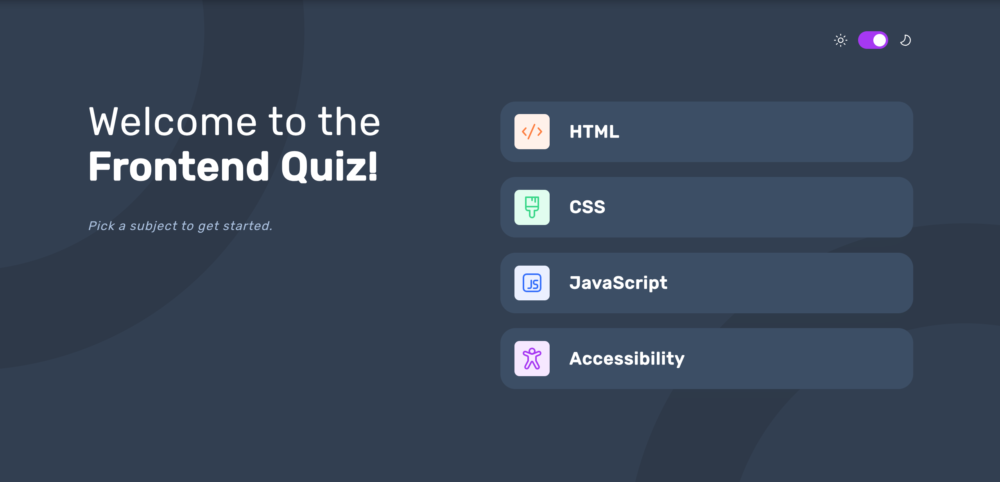

# Frontend Mentor - Frontend quiz app solution

This is a solution to the [Frontend quiz app challenge on Frontend Mentor](https://www.frontendmentor.io/challenges/frontend-quiz-app-BE7xkzXQnU). Frontend Mentor challenges help you improve your coding skills by building realistic projects.

## Table of contents

- [Overview](#overview)
  - [The challenge](#the-challenge)
  - [Screenshot](#screenshot)
- [My process](#my-process)
  - [Built with](#built-with)
  - [What I learned](#what-i-learned)
  - [Continued development](#continued-development)
- [Author](#author)

## Overview

### The challenge

Users should be able to:

- Select a quiz subject
- Select a single answer from each question from a choice of four
- See an error message when trying to submit an answer without making a selection
- See if they have made a correct or incorrect choice when they submit an answer
- Move on to the next question after seeing the question result
- See a completed state with the score after the final question
- Play again to choose another subject
- View the optimal layout for the interface depending on their device's screen size
- See hover and focus states for all interactive elements on the page
- Navigate the entire app only using their keyboard
- **Bonus**: Change the app's theme between light and dark

### Screenshot

### Links

- Solution URL: [https://github.com/Kulya1986/fm_project8_frontend_quiz_app](https://github.com/Kulya1986/fm_project8_frontend_quiz_app)
- Live Site URL: [Add live site URL here](https://your-live-site-url.com)

## My process

### Built with

- Semantic HTML5 markup
- CSS custom properties
- Flexbox
- CSS Grid
- Sass for styles
- [React](https://reactjs.org/) - JS library

### What I learned

This project has been a great challenge for me to practice in using useRef() hook to implement keybaord navigation. Definitely will continue on that in the next applications. Also touched slightly ARIA topic but still need to learn more on that.

Also used useImage() hook (found it on the Internet but can't recall the author or site) to load images to the page dynamically without using PUBLIC folder.

### Continued development

As stated above will further look into building accessible applications and expand on React hooks.

## Author

- Website - [Nataliia Kulyk](https://portfolio-page-sthy.onrender.com)
- Frontend Mentor - [@Kulya1986](https://www.frontendmentor.io/profile/Kulya1986)
